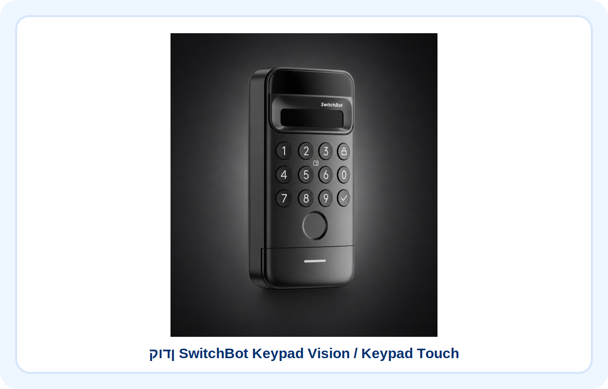
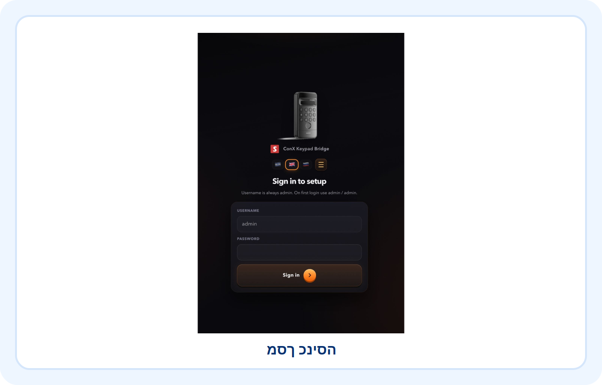
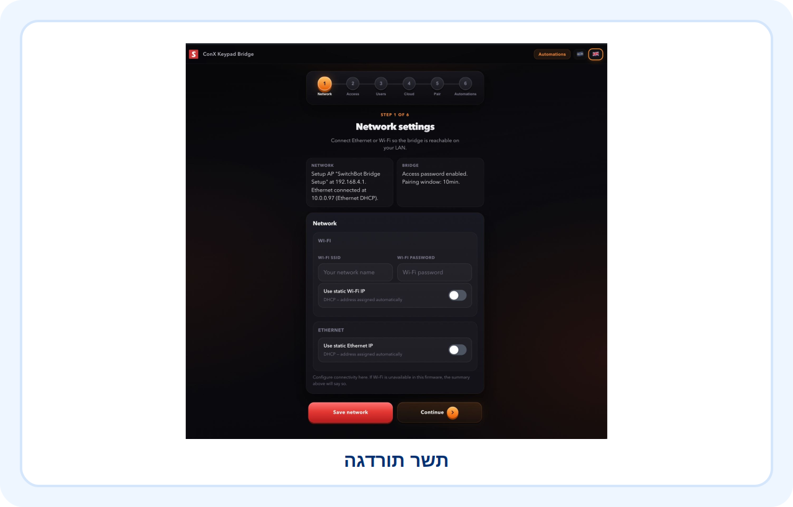
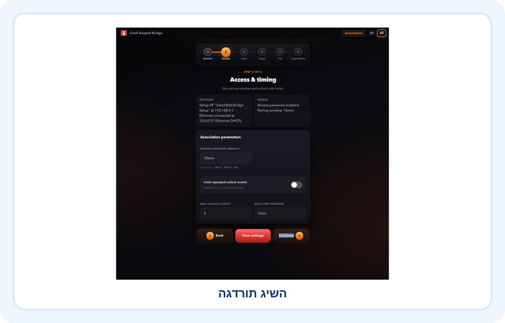
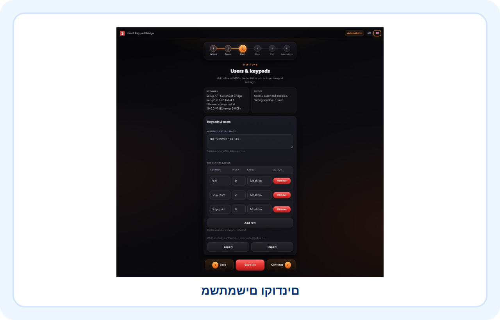
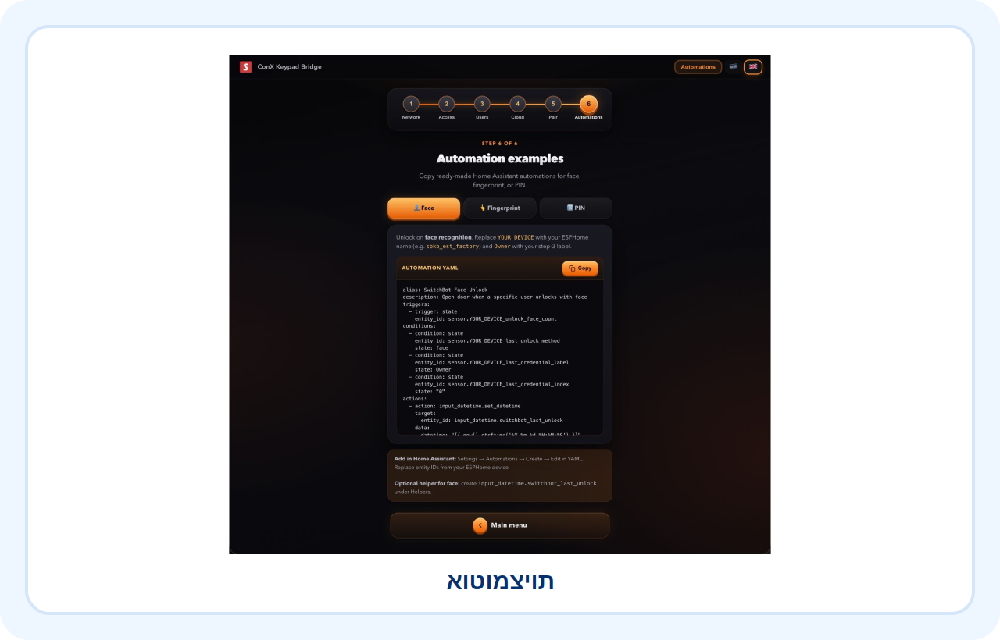
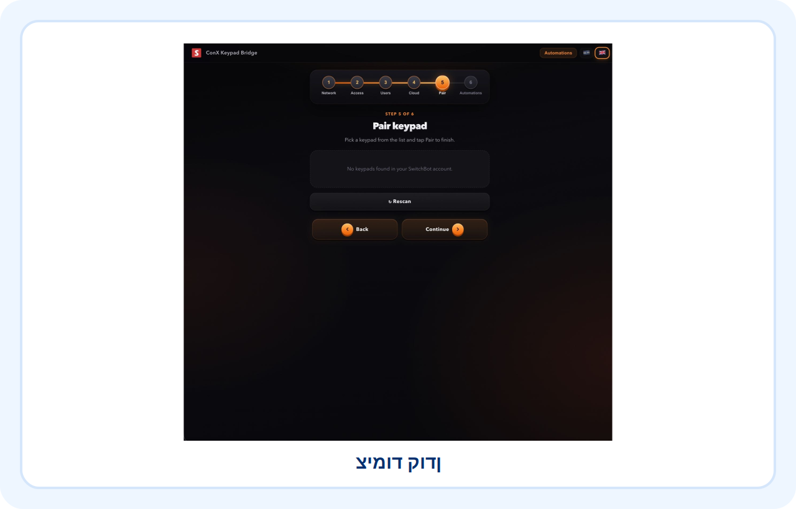
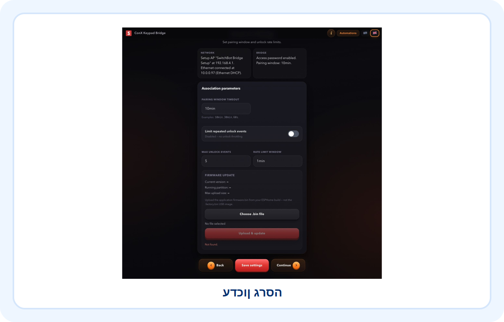
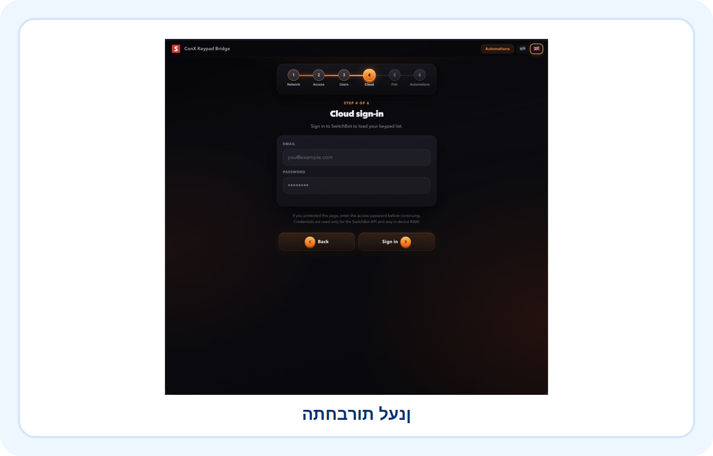
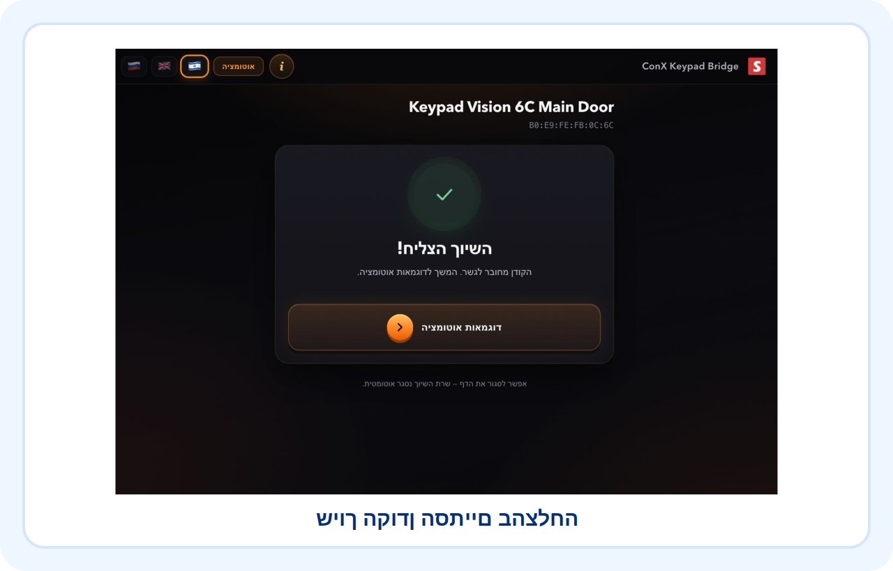

<div align="center" dir="rtl">

# SwitchBot Community

## ConX Keypad Bridge

**מדריך התקנה והפעלה מלא לשימוש ב־SwitchBot Keypad Vision / Keypad Touch עם Home Assistant דרך בקר ESP32.**




</div>

---

## מה המערכת עושה

**ConX Keypad Bridge** מאפשר להשתמש בקודן SwitchBot בלי מנעול SwitchBot פיזי. הקודן נצמד לבקר ESP32, והבקר מעביר אירועי פתיחה, נעילה, PIN, טביעת אצבע וזיהוי פנים אל Home Assistant. משם אפשר להפעיל מנעול, ממסר, התראה, מצלמה, לוג או כל אוטומציה אחרת.

---

## תכונות עיקריות

- חיבור SwitchBot Keypad Vision / Keypad Touch אל Home Assistant
- תמיכה ב־PIN, טביעת אצבע וזיהוי פנים
- עבודה עם ESP32
- ממשק הגדרות מקומי בעברית
- חיבור לענן SwitchBot באמצעות Token ו־Secret
- מצב אורח וקוד זמני
- עדכון גרסה OTA דרך הדפדפן
- אוטומציות Home Assistant מוכנות להעתקה

---

## תמונות מהמדריך

| מוצר | מסך כניסה |
|---|---|
|  |  |

| הגדרות רשת | הגדרות גישה |
|---|---|
|  |  |

| משתמשים וקודנים | אוטומציות |
|---|---|
|  |  |

| צימוד קודן | עדכון גרסה |
|---|---|
|  |  |

---

## חשוב מאוד לפני שמתחילים

לפני שמצמידים את הקודן לבקר ConX, חובה להגדיר באפליקציית SwitchBot הרשמית את כל המשתמשים הקבועים שרוצים לשמור על הקודן:

- קודי PIN
- טביעות אצבע
- זיהוי פנים

לאחר מכן יש לבצע **Unpair / ביטול שיוך בלבד** מהמנעול באפליקציית SwitchBot.

> אין לבצע Delete / מחיקה של הקודן מהחשבון.

המשתמשים נשמרים על הקודן עצמו. מחיקה מלאה עלולה לפגוע בהגדרה התקינה או להקשות על הבקר למצוא את הקודן.

---

## מה צריך להכין

- SwitchBot Keypad Vision או SwitchBot Keypad Touch
- בקר ESP32 עם Firmware של ConX Keypad Bridge
- רשת Wi-Fi יציבה
- Home Assistant פעיל
- חשבון SwitchBot עם API Token ו־API Secret
- מנעול, ממסר או אוטומציה קיימת לפתיחה בפועל

---

## תהליך התקנה מקוצר

### 1. הכנה באפליקציית SwitchBot

הגדר את המשתמשים הקבועים באפליקציית SwitchBot, כולל PIN, Fingerprint ו־Face Recognition. לאחר מכן בצע Unpair בלבד.

### 2. צריבה ראשונה של הבקר

חבר את הבקר למחשב, פתח את כלי ההתקנה שקיבלת, בחר את קובץ ה־`.bin` המתאים לדגם שלך וצרוב אותו לבקר.

### 3. פתיחת מסך ההגדרות

לאחר שהבקר עולה, פתח את ממשק ההגדרות המקומי והתחבר למסך הניהול.


### 4. הגדרת רשת

הגדר SSID, סיסמה ופרטי רשת.


### 5. אבטחה וגישה מקומית

הגדר פרטי כניסה, סיסמת גישה והרשאות.


### 6. שמות משתמשים והרשאות קודן

הגדר את המשתמשים וההרשאות שנשמרים בבקר.


### 7. התחברות לענן SwitchBot

הזן Token ו־Secret של SwitchBot Cloud.



### 8. צימוד הקודן לבקר

הפעל תהליך Pairing עד שהקודן מזוהה ומסיים שיוך בהצלחה.




### 9. חיבור ל־Home Assistant

לאחר שהבקר מחובר לרשת, יש להשתמש ב־Entities שנוצרו ב־Home Assistant לצורך אוטומציות.

### 10. יצירת אוטומציות

השתמש בדוגמאות למטה לפתיחה לפי זיהוי פנים, טביעת אצבע או PIN.


### 11. מצב אורח וקוד זמני

מצב אורח מאפשר ליצור קודים זמניים עם תוקף מוגבל ולנהל מחיקה, פקיעת תוקף ולוג פנימי.

### 12. עדכון גרסה OTA

ניתן לעדכן Firmware דרך ממשק הבקר באמצעות קובץ `.bin` מוכן.


---

## אוטומציות Home Assistant

### פתיחה באמצעות זיהוי פנים

```yaml
description: Notify when Moshiko unlocks with face recognition
mode: single
triggers:
  - entity_id: sensor.switchbot_keypad_bridge_unlock_face_count
    trigger: state
conditions:
  - condition: template
    value_template: |
      {{ trigger.from_state is not none
         and trigger.from_state.state not in ['unknown', 'unavailable']
         and trigger.to_state.state not in ['unknown', 'unavailable']
         and trigger.from_state.state != trigger.to_state.state }}
  - condition: state
    entity_id: sensor.switchbot_keypad_bridge_last_unlock_method
    state: face
  - condition: state
    entity_id: sensor.switchbot_keypad_bridge_last_credential_label
    state: מושיקו
  - condition: state
    entity_id: sensor.switchbot_keypad_bridge_last_credential_index
    state: "0"
actions:
  - action: input_datetime.set_datetime
    target:
      entity_id: input_datetime.switchbot_last_unlock
    data:
      datetime: "{{ now().strftime('%Y-%m-%d %H:%M:%S') }}"
  - action: lock.unlock
    metadata: {}
    target:
      device_id: 1234
    data: {}
```

### פתיחה באמצעות טביעת אצבע

```yaml
description: Notify when Moshiko unlocks with face recognition
mode: single
triggers:
  - entity_id: sensor.switchbot_keypad_bridge_unlock_fingerprint_count
    trigger: state
conditions:
  - condition: template
    value_template: |
      {{ trigger.from_state is not none
         and trigger.from_state.state not in ['unknown', 'unavailable']
         and trigger.to_state.state not in ['unknown', 'unavailable']
         and trigger.from_state.state != trigger.to_state.state }}
  - condition: state
    entity_id: sensor.switchbot_keypad_bridge_last_unlock_method
    state: fingerprint
  - condition: state
    entity_id: sensor.switchbot_keypad_bridge_last_credential_label
    state: מושיקו
  - condition: state
    entity_id: sensor.switchbot_keypad_bridge_last_credential_index
    state: "2"
actions:
  - action: input_datetime.set_datetime
    target:
      entity_id: input_datetime.switchbot_last_unlock
    data:
      datetime: "{{ now().strftime('%Y-%m-%d %H:%M:%S') }}"
  - action: lock.unlock
    metadata: {}
    target:
      device_id: 1234
    data: {}
```

### פתיחה באמצעות קוד PIN

```yaml
description: Notify when Moshiko unlocks with pin recognition
mode: single
triggers:
  - entity_id: sensor.switchbot_keypad_bridge_unlock_pin_count
    trigger: state
conditions:
  - condition: template
    value_template: |
      {{ trigger.from_state is not none
         and trigger.from_state.state not in ['unknown', 'unavailable']
         and trigger.to_state.state not in ['unknown', 'unavailable']
         and trigger.from_state.state != trigger.to_state.state }}
  - condition: state
    entity_id: sensor.switchbot_keypad_bridge_last_unlock_method
    state: pin
  - condition: state
    entity_id: sensor.switchbot_keypad_bridge_last_credential_label
    state: מושיקו
  - condition: state
    entity_id: sensor.switchbot_keypad_bridge_last_credential_index
    state: "1"
actions:
  - action: input_datetime.set_datetime
    target:
      entity_id: input_datetime.switchbot_last_unlock
    data:
      datetime: "{{ now().strftime('%Y-%m-%d %H:%M:%S') }}"
  - action: lock.unlock
    metadata: {}
    target:
      device_id: 1234
    data: {}
```

---

## מבנה מומלץ בריפו

```text
.
├── README.md
├── docs/
│   ├── images/
│   │   ├── 01-product-keypad.svg
│   │   ├── 02-login-screen.svg
│   │   ├── ...
│   └── user-guide.html
└── SwitchBot-Keypad-Bridge-Guide.md
```

---

## פתרון תקלות מהיר

### הקודן לא נמצא

- ודא שבוצע Unpair ולא Delete.
- ודא שהקודן פעיל וטעון.
- ודא שהבקר קרוב מספיק לקודן בזמן הצימוד.

### Home Assistant לא מגיב

- בדוק שהבקר מחובר לרשת.
- בדוק שה־Entities קיימים.
- בדוק שה־device_id באוטומציה מתאים למנעול שלך.

### OTA נכשל

- ודא שהחיבור לרשת יציב.
- ודא שקיבלת קובץ `.bin` מתאים.
- לאחר העלאה המתן לאתחול מלא של הבקר.

---

## מסמכים נוספים

- [מדריך HTML מלא](docs/user-guide.html)
- [מדריך Markdown מלא](SwitchBot-Keypad-Bridge-Guide.md)

---

<div align="center" dir="rtl">

נבנה עבור קהילת **SwitchBot Community** ו־Home Assistant.

</div>
